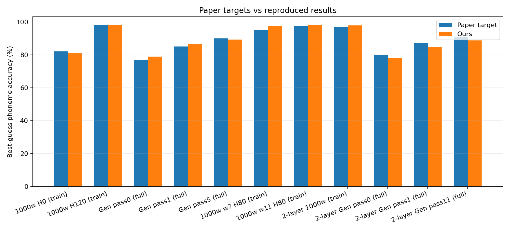

# nettalk

From-scratch NumPy reproduction of NETtalk: Sejnowski and Rosenberg, *Parallel Networks that Learn to Pronounce English Text*, Complex Systems 1(1), 1987. In the spirit of [lecun1989-repro](https://github.com/karpathy/lecun1989-repro).



## Task

Per letter, predict the phoneme and stress of the center letter from a fixed window of surrounding letters (7 by default).

## Network

| | |
|---|---|
| Inputs | 7 x 29 = 203 (26 letters plus boundary, period, apostrophe per window position) |
| Hidden | one layer, 0/15/30/60/80/120 units by experiment |
| Outputs | 26 (21 articulatory phoneme features, 5 stress/boundary) |
| Units | sigmoid, mean-squared error |
| Update | one per word, gradients summed over the word's letters |
| Margin gate | 0.1 |
| Weight init | [-0.3, 0.3] |
| Learning rate | 1.0 |

Best-guess accuracy uses the paper's angle-based decode: nearest phoneme code by cosine similarity over the full inventory.

## Results (`--profile paper`)

| Metric | Paper | Ours |
|---|---:|---:|
| 1000 words, H=0 (train best-guess) | 82.0 | 81.0 |
| 1000 words, H=120 (train best-guess) | 98.0 | 98.0 |
| Full-dictionary generalization, pass 0 | 77.0 | 78.9 |
| Full-dictionary generalization, pass 1 | 85.0 | 86.6 |
| Full-dictionary generalization, pass 5 | 90.0 | 89.3 |
| Two hidden layers (80,80), 1000 words (train) | 97.0 | 97.9 |

Divergences (window-size sweep, deep-net generalization) are logged in [RESULTS_REPORT.md](RESULTS_REPORT.md), with every experiment, its knobs, and the locked decisions and exclusions.

The paper says "accumulate over letters, update once per word" without specifying normalization. This reproduction sums rather than averages, which is what reaches 98%.

## Scope

Reproduced: hidden-unit scaling (Fig 6a), hard vs soft `c` (Fig 6b), full-dictionary generalization with continued training, window-size sweep (3-11), two-hidden-layer network, hidden-representation clustering (Fig 8 method), quantization tolerance, damage/relearning, spacing-effect proxy, power-law loss fit.

Not covered: the informal continuous-speech corpus (alignment not reconstructible from the printed Carterette and Jones transcription) and the 1986 output encoding.

## Data

UCI "Connectionist Bench (NetTalk Corpus)" (`data/raw/nettalk.data`), aligned letter-by-letter with phoneme and stress strings. After filtering to alphabetic words with matching lengths and keeping the first pronunciation: 19,801 unique words (paper reports 20,012). Common-word subset is the benchmark's reconstructed 1,000-word list; holdout is the remaining 18,801. Output encoding: `data/processed/phoneme_features.json`.

Corpus license per `data/raw/nettalk.names`: Copyright (c) 1988 Terrence J. Sejnowski, non-commercial research use. The MIT license covers the code only.

## Run

```bash
pip install -r requirements.txt

python prepro.py                      # build data/processed/repro/*.npz
python repro.py --profile paper       # dictionary experiments -> results/ + figs/
python time_travel.py --profile paper # modern-optimizer ablations
```

`--profile fast` for a smoke run. Outputs land in `results/` (CSV/JSON) and `figs/` (PNG), checked in.

## Layout

```
nettalk/            reproduction package (pure NumPy, no autograd)
  data.py           parsing, window encoding, artifact build
  model.py          single- and multi-hidden-layer MLPs
  train.py          per-word update loop, margin gate, SGD/Adam
  eval.py           angle-based best-guess + perfect-match metrics
  experiments.py    experiment runners
  plots.py          figure generation
prepro.py           build preprocessed datasets
repro.py            dictionary experiments
time_travel.py      modern-optimizer ablations
scripts/            seed-sensitivity diagnostic
results/, figs/     checked-in outputs
```

## License

MIT. See [LICENSE](LICENSE).
