# NETtalk: 39 years ago and 39 years from now

Feb 2026

Sejnowski and Rosenberg, NETtalk, Complex Systems, 1987. Reproduction of the 1987 NETtalk dictionary experiments, plus a controlled "time travel" modernization section.

## Scope (what we do and do not claim)

Included (paper-aligned, dictionary track):

- 7-letter sliding window input, unary 29-way character encoding per position
- 21 articulatory feature outputs + 5 stress/boundary outputs (26 total)
- MSE + sigmoid units + per-word updates + 0.1 margin gate
- 1000-word scaling with `H ∈ {0,15,30,60,120}` (Figure 6(a))
- hard vs soft "c" rule learning curves (Figure 6(b))
- generalization to the full dictionary after 1000-word pretraining (77% -> 85% -> 90%)
- window-size sweep from 3 to 11 input groups (paper text)
- two-hidden-layer (80,80) experiment (paper text)
- hidden representation clustering (Figure 8 method)
- quantization / "bits per weight" style test

Explicit exclusions (by agreement):

- Informal speech corpus replication (Carterette and Jones continuous speech alignment is not reproducible from the book alone)
- 1986 output encoding fork (23+3 vs 21+5). We implement the 1987 encoding only.

## Repo shape and how to run (deterministic)

```bash
python prepro.py
python repro.py --profile paper
python time_travel.py --profile paper
```

Outputs:

- Preprocessed datasets: `data/processed/repro/*.npz`
- Results tables: `results/*.csv`, `results/*.json`
- Figures: `figs/*.png`

### Paper profile (exact knobs)

All "paper target" comparisons in this document are generated with `--profile paper`:

| Knob | Passes |
|---|---:|
| 1000-word training passes (scaling, generalization pretrain) | 55 |
| full dictionary passes after pretraining (wide net) | 5 |
| window-size sweep passes | 55 |
| two-layer full dictionary passes after pretraining | 11 |
| damage pretraining passes | 25 |
| spacing pretraining passes | 25 |

## What NETtalk is actually doing

Task: predict the phoneme plus stress and boundary features for the center letter of a fixed-width sliding character window.

Two regimes:

- a dictionary corpus with pre-aligned letter-to-phoneme strings (reproduced here)
- a continuous informal speech corpus with connected-speech effects (excluded here)

## Implementation

Pure NumPy. No autograd, no PyTorch, no JAX.

### Data source and parsing

- Data source: UCI "NetTalk Corpus" benchmark format (`data/raw/nettalk.data`, `data/raw/nettalk.names`).
- Primary input to the pipeline: `nettalk.data`. Each entry aligned letter-by-letter: `word`, `phonemes`, `stress` strings of identical length.
- Checked-in parsed JSON: audit cache only, not the primary source for experiments.

Parsing and filtering (`nettalk/data.py`):

- Keep only rows with 4 tab-separated fields and `len(word)==len(phonemes)==len(stress)`.
- Keep only `word.isalpha()` (punctuation stays in the input vocabulary but does not occur inside words in this track).
- Lowercase words for consistent indexing.
- Deduplicate multiple-pronunciation entries by keeping the first pronunciation per word (per benchmark docs).

After filtering and deduplication:

| Set | Count |
|---|---:|
| Full dictionary (unique words) | 19,801 (paper reports 20,012) |
| Common-word subset | 1,000 |
| Holdout set (dictionary minus common) | 18,801 |

### Input encoding (29-way unary per position)

Each window position, 29 units (`nettalk/constants.py`, `nettalk/data.py`):

- 26 letters `a..z`
- 3 extra symbols: blank word boundary `_`, period `.`, apostrophe `'`

Input dimension = `w * 29`. Baseline `w=7`: `7*29 = 203` inputs.

Windows constructed word-by-word (dictionary regime). Out-of-word positions filled with the blank boundary symbol `_`.

### Output encoding (26 dims: 21 articulatory + 5 stress/boundary)

26 sigmoid output units:

- 21 phoneme feature units (place/manner/voicing/vowel height etc.)
- 5 stress/boundary units (`right`, `left`, `strong`, `weak`, `boundary`)

Mapping from phoneme symbols to 21-bit feature vectors, and stress symbols to 5-bit encodings: stored in `data/processed/phoneme_features.json`, loaded via `nettalk/data.py`.

Stress symbols in the dataset: `0,1,2,<,>,-` (map to subsets of the 5 stress/boundary units).

### Model

Baseline (`nettalk/model.py`): fully-connected MLP, sigmoid units everywhere, explicit bias vectors (`b1`, `b2`).

| Use | Architecture |
|---|---|
| scaling sweep | `203 -> H -> 26`, `H ∈ {0,15,30,60,120}` |
| standard analysis model | `203 -> 80 -> 26` |
| two-layer experiment | `203 -> 80 -> 80 -> 26` (`NettalkDeepMLP`) |

### Training loop (the most important "mechanical" detail)

Per-word update (`nettalk/train.py`):

- For each word, accumulate gradients over all its letters (each letter is a forward/backward pass).
- Apply exactly one parameter update per word.
- Margin gate: for each output unit, errors with `|pred - target| <= 0.1` treated as zero (no gradient contribution).
- Weight initialization: uniform in `[-0.3, 0.3]`.
- Learning rate: 1.0 (1987 mode), SGD, no momentum.

Locked decision: per-letter gradients are accumulated and the update applied once per word, without averaging by word length.

### Metrics

1. Phoneme "best guess" accuracy (primary)
2. Stress "best guess" accuracy (secondary)
3. "Perfect match" rate, margin 0.1 (strict diagnostic)

"Best guess" decoding: cosine/angle-based, matching the benchmark definition — an output is correct if closer (smallest angle) to the correct phoneme code than to any other phoneme code. Implemented (`nettalk/eval.py`) as cosine similarity against the full phoneme inventory, not just the subset present in a specific split.

## Reproducing the 1987 dictionary results

### Paper targets vs ours

Source table: `results/paper_target_comparison.csv`
Figure: `figs/paper_target_comparison.png`

| Metric | Paper target (%) | Ours (%) |
|---|---:|---:|
| 1000w, H=0 (train best-guess) | 82.00 | 81.00 |
| 1000w, H=120 (train best-guess) | 98.00 | 97.96 |
| Generalization pass 0 (full dict) | 77.00 | 78.87 |
| Generalization pass 1 (full dict) | 85.00 | 86.61 |
| Generalization pass 5 (full dict) | 90.00 | 89.27 |
| Window w=7, H=80 (train) | 95.00 | 97.72 |
| Window w=11, H=80 (train) | 97.50 | 98.20 |
| 2-layer (80,80) 1000w (train) | 97.00 | 97.92 |
| 2-layer pass 0 (full dict) | 80.00 | 78.28 |
| 2-layer pass 1 (full dict) | 87.00 | 84.82 |
| 2-layer pass 11 (full dict) | 91.00 | 88.79 |


- Two-layer network matches training-set accuracy; full-dictionary generalization is below the paper's reported 87% (pass 1) and 91% (pass 11).
- Window-size numbers are higher than the paper's reported 95% (w7, H=80). See "Divergences" below.

### Scaling with hidden units (Figure 6(a))

Data:

- `results/scaling_summary.csv`
- `results/scaling_history_hidden_*.csv`

Figures:

- `figs/scaling_hidden_units.png`
- `figs/scaling_histories.png`

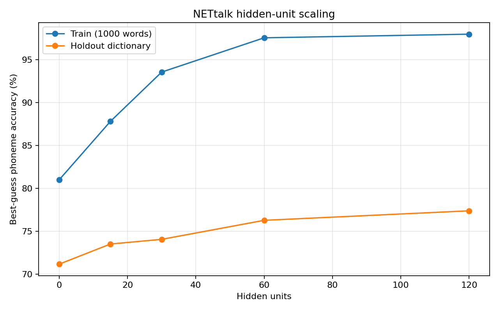

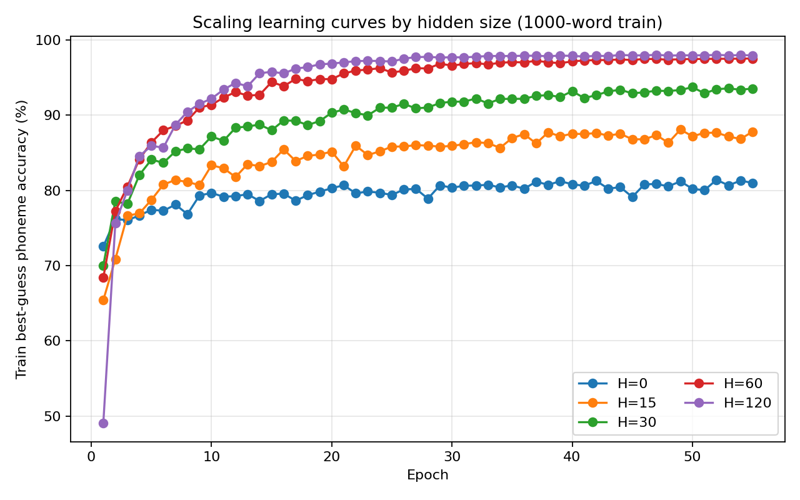

Result:

- `H=0`: model saturates at a lower ceiling (linearly separable component).
- More hidden units: faster learning, higher asymptotic training accuracy.

### Rule learning: hard vs soft "c" (Figure 6(b))

Correspondences:

- hard "c": `c -> k` (more common)
- soft "c": `c -> s` (rarer, learned later)

Correspondence accuracy computed during the 1000-word pretraining run. Occurrences in the 1000-word corpus:

| Correspondence | Occurrences |
|---|---:|
| hard-c | 134 |
| soft-c | 58 |

Ratio: ~2.3x (paper: "about twice as often").

Data: `results/hard_soft_c_learning.csv`
Figure: `figs/hard_soft_c_learning.png`

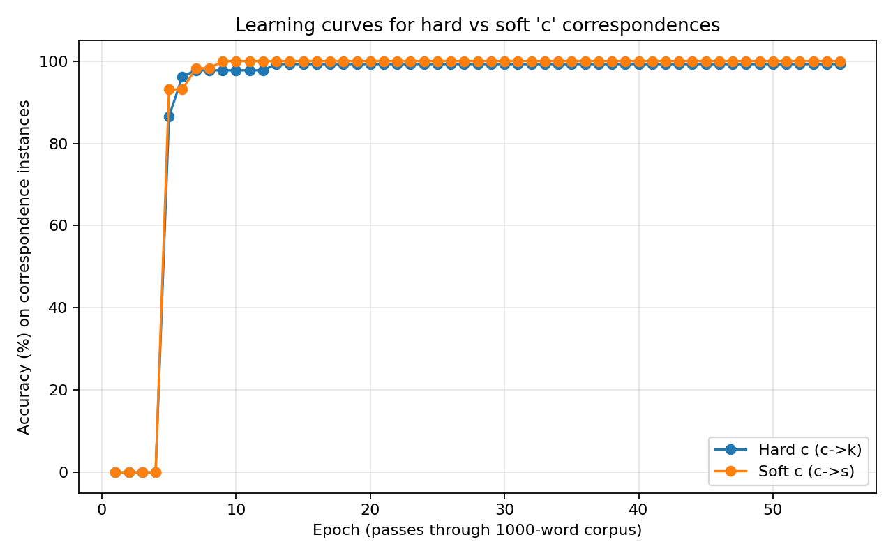

### Dictionary generalization and continued training (77% -> 85% -> 90%)

Procedure (paper-aligned):

1. Train `w=7, H=120` on the 1000-word common subset for 55 passes.
2. Evaluate on the full dictionary without training (pass 0).
3. Continue training on the full dictionary for 5 passes, evaluating after each pass.

Data:

- `results/generalization_pretrain_history.csv`
- `results/generalization_dictionary_passes.csv`

Figures:

- `figs/generalization_pretrain_history.png`
- `figs/generalization_dictionary_passes.png`

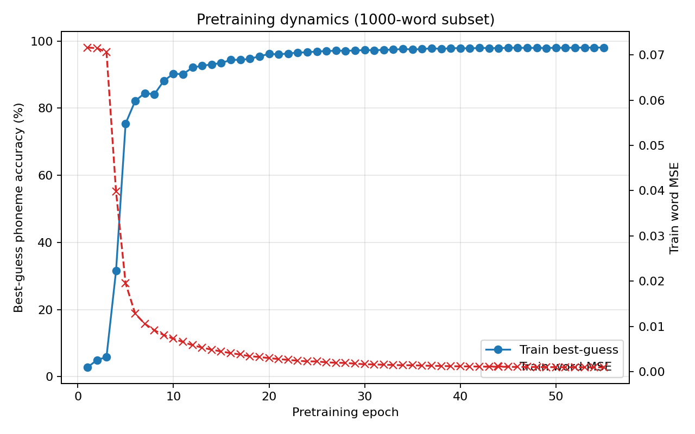

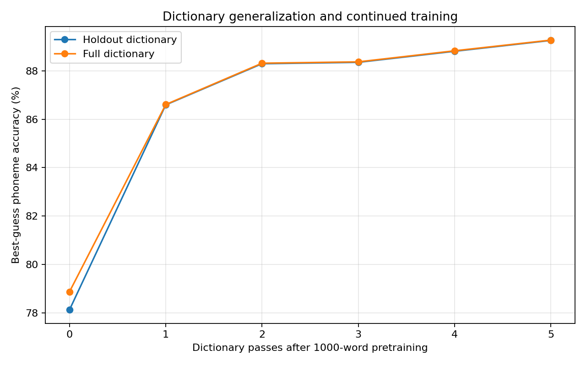

### Window size (3 to 11 input groups)

Sweep at fixed hidden size `H=80`, window sizes `w ∈ {3,5,7,9,11}`.

Data: `results/window_size_learning.csv`
Figure: `figs/window_size_learning.png`

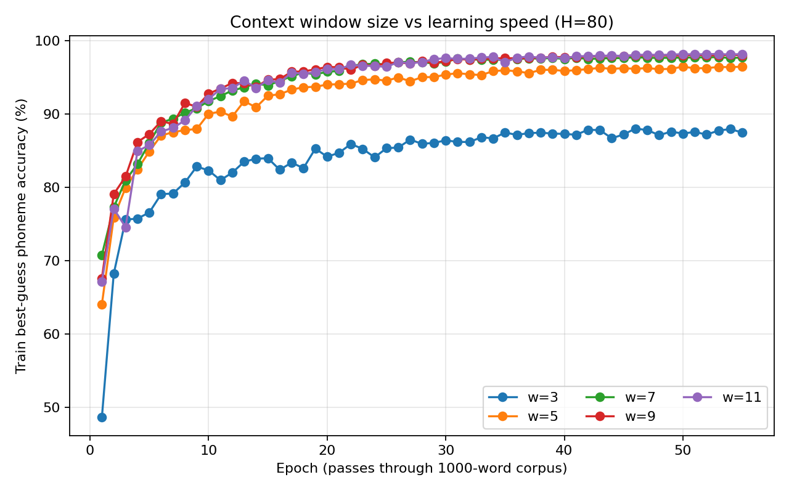

### Two hidden layers (80,80)

Procedure:

1. Pretrain `203 -> 80 -> 80 -> 26` for 55 passes on the 1000-word subset.
2. Evaluate full dictionary without training (pass 0).
3. Train the full dictionary for 11 passes, evaluating after each pass.

Data:

- `results/two_layer_pretrain_history.csv`
- `results/two_layer_dictionary_passes.csv`

Figures:

- `figs/two_layer_pretrain_history.png`
- `figs/two_layer_dictionary_passes.png`
- `figs/wide_vs_deep_generalization.png`

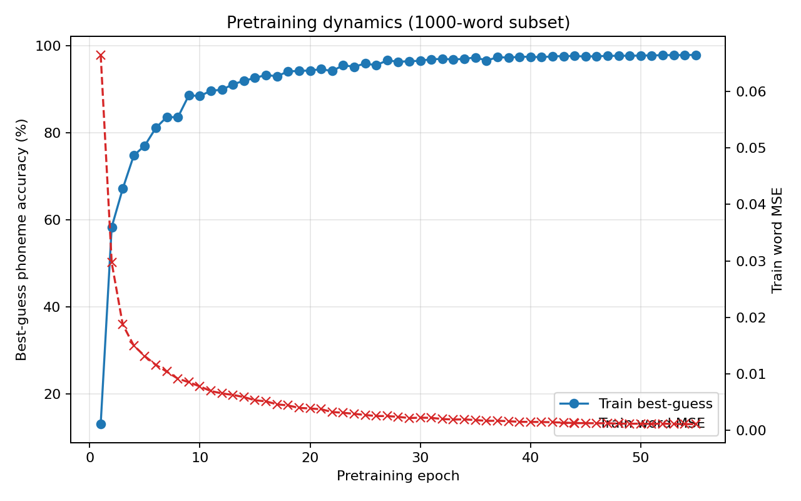

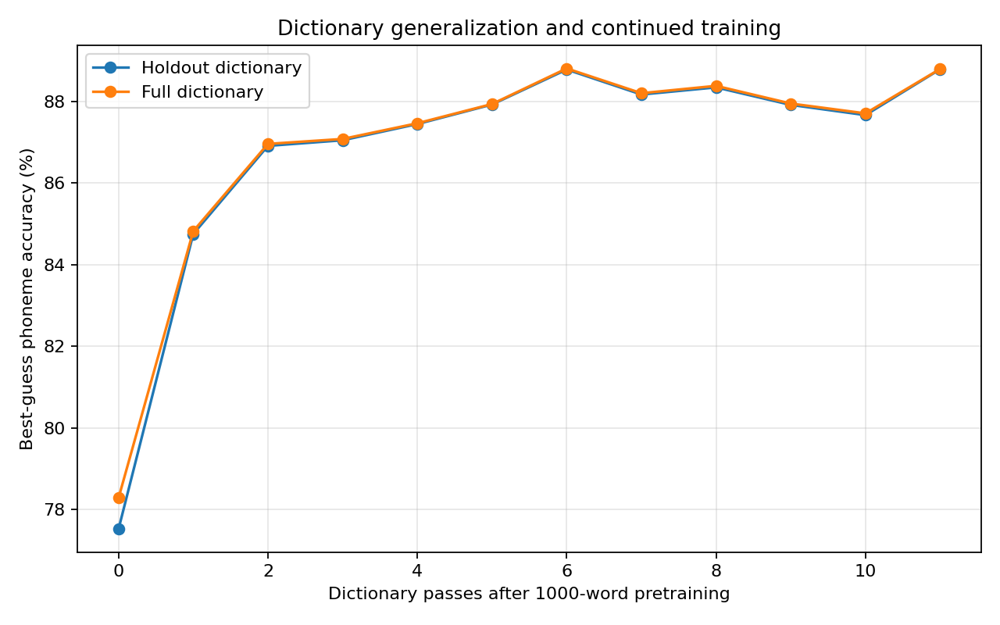

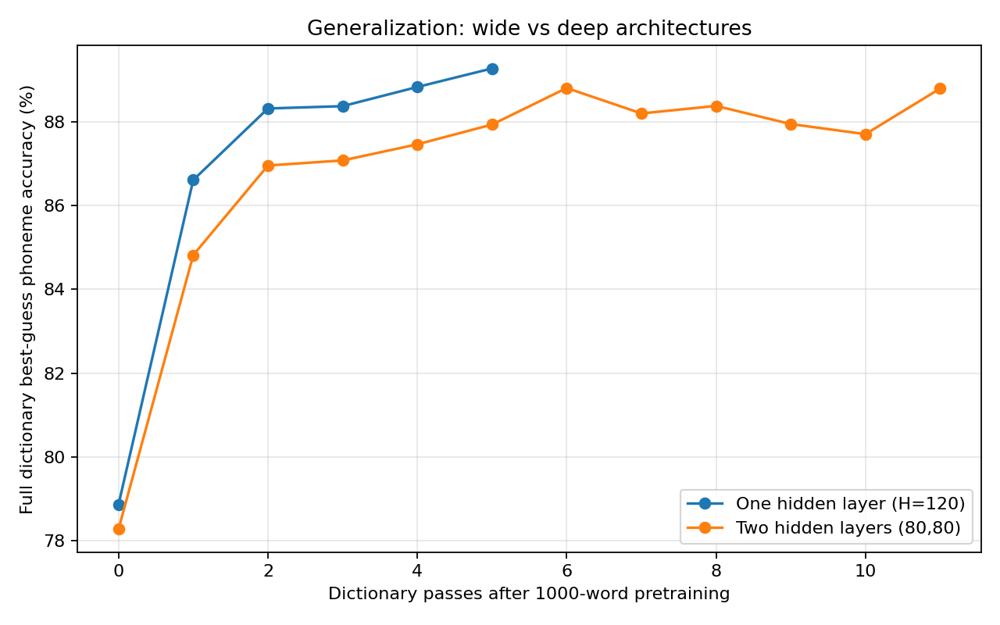

## Representation analyses and "phenomena"

### Hidden representation clustering (Figure 8 method)

Method:

- For each letter-to-sound correspondence (operationalized as `center_letter -> center_phoneme`), average the hidden activation vectors across all occurrences.
- Cluster the averaged vectors with Euclidean distance and complete linkage.

Data:

- `results/hidden_clustering.json`
- `results/hidden_clustering_merges.csv`

Figures:

- `figs/hidden_cluster_heatmap.png`
- `figs/hidden_cluster_merges.png`
- `figs/hidden_cluster_dendrogram.png`

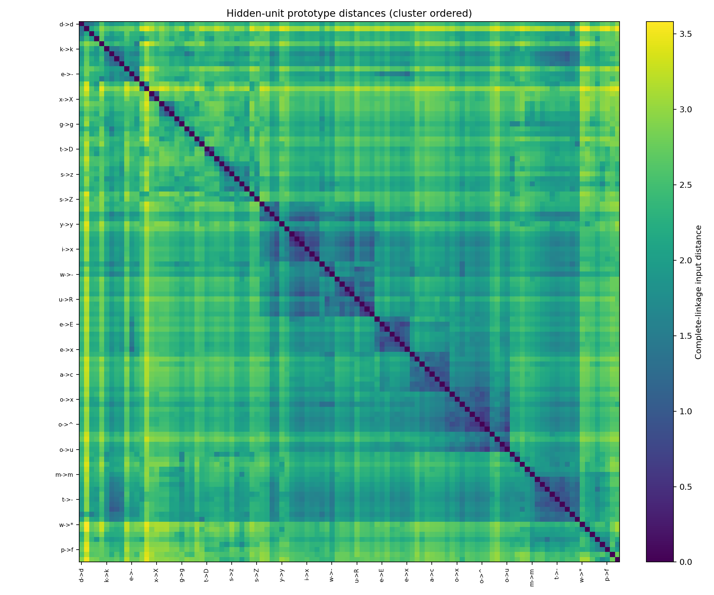

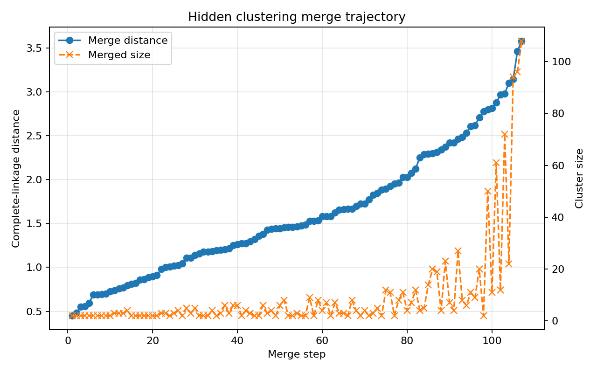

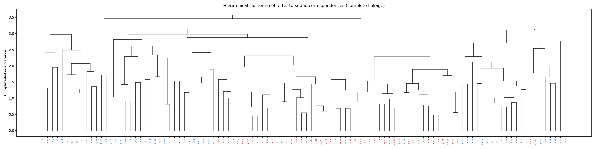

Result: biggest split is vowel-like vs consonant-like correspondences; individual weights differ across runs.

### Quantization tolerance ("bits per weight")

Method: quantize trained parameters to symmetric `b`-bit levels, re-evaluate.

Data: `results/quantization_curve.csv`
Figure: `figs/quantization_curve.png`

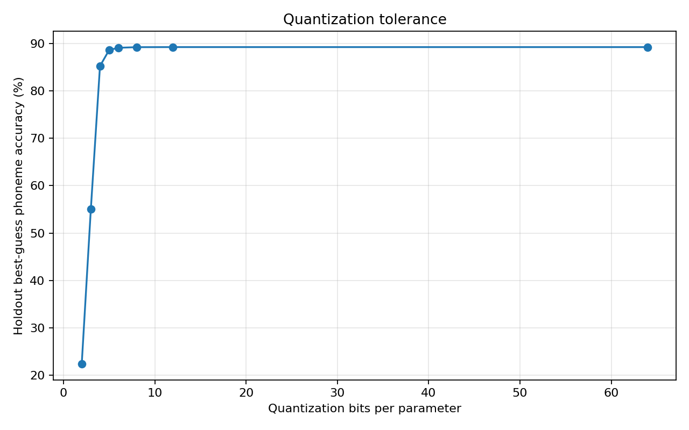

### Damage and relearning

Method:

- Sample one uniform perturbation pattern over the trained weights.
- Scale that same pattern across damage levels.
- Compare relearning from the 30%-damaged model to fresh training.

Data:

- `results/damage_curve.csv`
- `results/relearning_after_damage.csv`
- `results/fresh_relearning_baseline.csv`

Figures:

- `figs/damage_curve.png`
- `figs/relearning_vs_fresh.png`

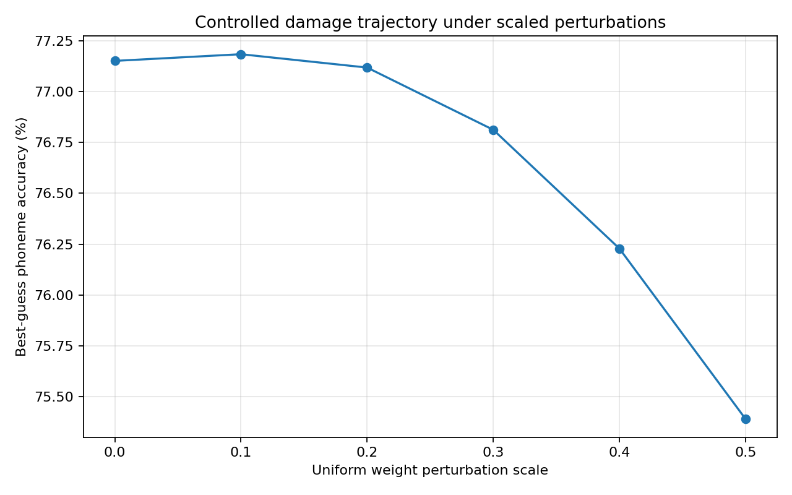

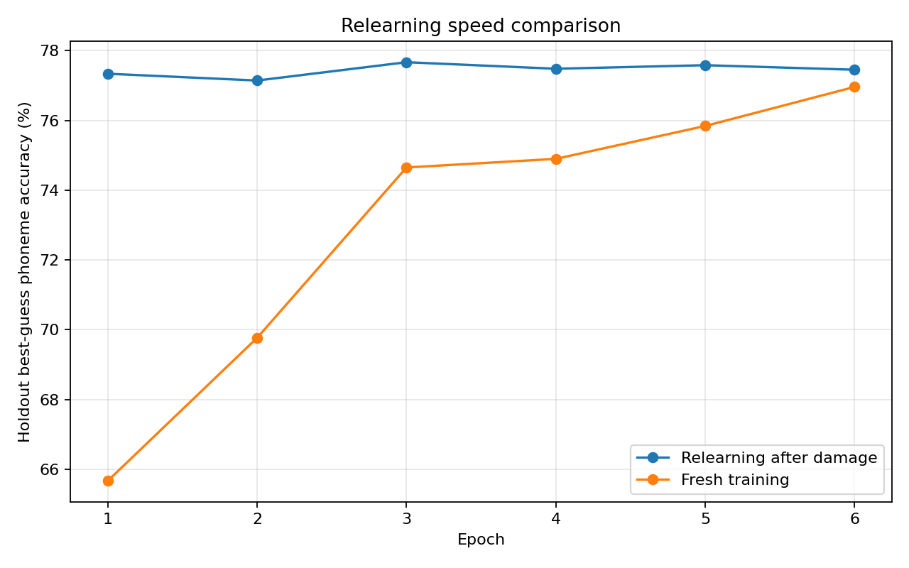

### Spacing effect proxy (massed vs interleaved)

Minimal schedule proxy, matched exposure counts, fixed order:

- Both schedules use the same number of novel presentations and the same sampled old-word rehearsals.
- Massed: present all novel-word repetitions first, then the matched old-word rehearsals.
- Interleaved: alternate each novel-word presentation with one of those same old-word rehearsals.
- Schedule order preserved during training by disabling shuffling for this comparison.

Data: `results/spacing_experiment.json`
Figure: `figs/spacing_experiment.png`

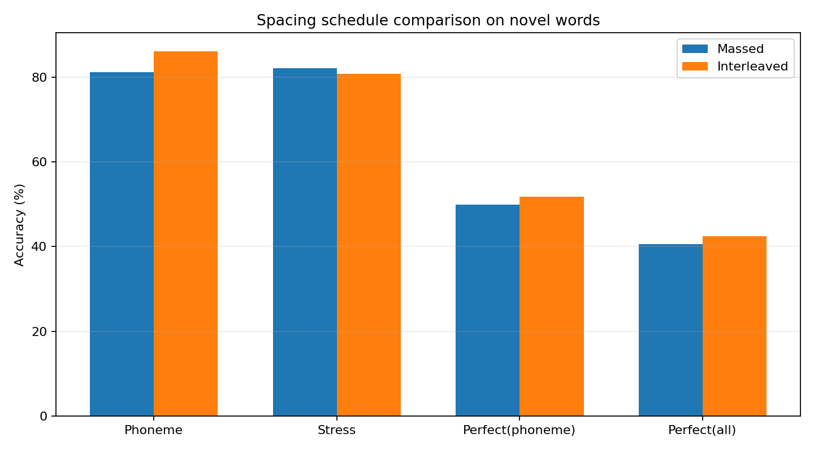

### Power-law fit (loss vs training)

Method: fit a power law to the pretraining loss trajectory (dictionary-only scope).

Data: `results/power_law_fit.json`
Figure: `figs/power_law_fit.png`

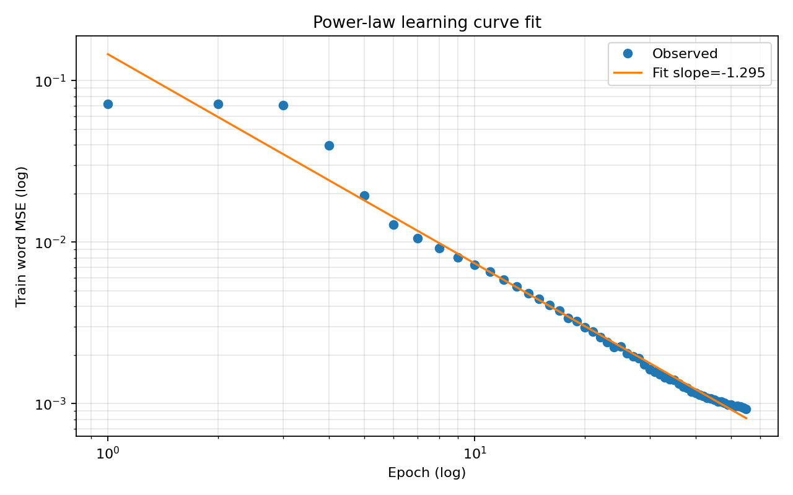

## Cheating with time travel (modernization, controlled)

Setup: task interface held fixed (same input, same output encoding, same decoding metric); only optimization mechanics changed.

Data: `results/time_travel_ablation.csv`
Figure: `figs/time_travel_ablation.png`

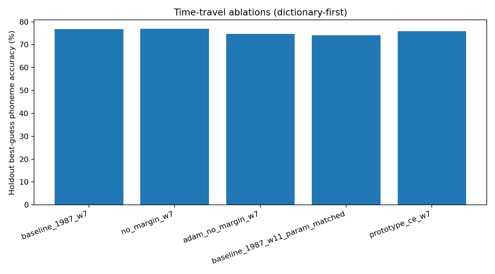

Numbers (holdout dictionary, `w=7` unless noted):

| Variant | Phoneme best-guess (%) | Perfect match (all 26) (%) |
|---|---:|---:|
| baseline 1987 | 76.72 | 40.39 |
| no margin gate | 76.96 | 44.57 |
| Adam + no margin | 74.72 | 45.77 |
| baseline `w=11` (parameter-matched, `H=56`) | 74.16 | 36.82 |
| prototype cross-entropy (decoder-trained) | 75.87 | 0.80 |

Results:

- Removing the margin gate: perfect-match up substantially, best-guess up slightly.
- Adam (no margin gate): perfect-match higher still, best-guess down.

### Training the decoder directly (prototype cross-entropy)

Method:

- Nearest-angle decoding is an argmax over cosine similarity between the 21-feature output and each phoneme code; this decision is differentiable.
- Treat phoneme codes as fixed prototypes: cosine similarity between output block and every prototype, divided by a temperature, softmax, cross-entropy to the correct phoneme (same construction for the 5-dim stress block).
- Only the gradient changes; input encoding, output encoding, and test-time decoding are identical.
- Loss and gradient in `nettalk/prototype.py`, checked against central finite differences to `< 5e-8` (`scripts/check_prototype_gradient.py`).

Result: does not beat plain MSE.

Hyperparameters (temperature, learning rate, optimizer, MSE weight, finetune schedule) selected on a 900/100-word validation split of the 1000-word training set; dictionary holdout not used for selection.

Three-seed holdout results (seeds 42/43/44):

| Configuration | Best-guess (%) | Perfect match, all 26 (%) |
|---|---:|---:|
| pure prototype-CE | 75.24 ± 0.48 | 0.86 ± 0.13 |
| prototype-CE + MSE anchor (`λ=0.3`) | 75.70 ± 0.24 | 14.42 ± 2.11 |
| MSE pretrain → CE finetune | 77.08 ± 0.28 | 34.09 ± 3.36 |
| (MSE-only starting point, for reference) | 76.97 | n/a |

Best decoder-aware configuration: 55-epoch margin-gate MSE, then 5 epochs of cosine-CE finetune at Adam `lr=1e-3`, `τ=0.05`. Result: 77.08% ± 0.28%.

- Its own MSE starting point averages 76.97% across the three seeds.
- Finetune contributes +0.11 on average (per-seed range −0.03 to +0.29).

Two mechanisms:

1. Magnitude blindness. Cosine similarity constrains only the direction of the output, not its length. Pure prototype-CE: perfect-match under 1%. Reintroducing an MSE term: perfect-match 14-45%.
2. Ill-conditioned discrimination. Phoneme prototype matrix is rank-deficient (participation-ratio effective rank ≈ 16 of 21; one identical code pair; ≈ 10% of class pairs at cosine > 0.5). Softmax over near-collinear, partly degenerate directions produces weak gradients on the hardest-to-distinguish phonemes. MSE regresses each output unit toward its target independently (dense, well-conditioned signal); those outputs decode correctly under nearest-angle without solving the separation.

## Decisions, divergences, and open questions (canonical log)

### Locked decisions (we consider these faithful)

1. Dictionary track only: pre-aligned `word / phonemes / stress` strings.
2. Input encoding: 7 positions x 29 unary units, with blank boundary padding.
3. Output encoding: 21 articulatory + 5 stress/boundary units (1987/benchmark spec).
4. Sigmoid units + MSE + per-word updates with a 0.1 margin gate.
5. Weight init uniform `[-0.3, 0.3]`.
6. Best-guess decoding by smallest angle against the phoneme inventory (full inventory, not split-local).
7. Multiple pronunciations: keep first pronunciation per word (benchmark spec).
8. Word-level update is a sum across letters (no averaging by word length).
9. Train order is shuffled each epoch except in the spacing comparison, where order is the intervention and shuffling is disabled.

### Reproduction divergences (these can move numbers)

1. Dictionary size mismatch: paper reports 20,012 words; our filtered, deduped benchmark dictionary has 19,801.
2. 1000-word list: we use the reconstructed list included with the benchmark, not the original lost list.
3. Exact training order, random seeds, and any historical implementation quirks are unknown.
4. Weight-count mismatch: the paper quotes 18,629 weights for the 80-hidden "standard" network; the fully-connected count for 203-80-26 with biases is 18,426. We implement the fully-connected architecture; the extra 203 weights in the paper remain unexplained.
5. Two-layer generalization mismatch: our `80,80` network does not reach the reported 87% (pass 1) or 91% (pass 11) on the full dictionary. This could be dataset differences, implementation details, or both.
6. Dictionary filtering: we keep only `word.isalpha()` entries, which can remove hyphenated/marked items that might exist in other copies of the dataset.
7. Stress/boundary coding is taken from the benchmark mapping file; if the paper used a slightly different stress interpretation, stress-related metrics can drift.

### Exclusions (out of scope)

1. Informal speech corpus: alignment and symbol mapping are not reconstructible from the printed book transcription alone.
2. 1986 output encoding variant: not implemented (we pick the 1987 encoding as canonical).

## Findings

1. Per-word updates, margin gating, and sum-vs-average over word letters decide whether the 98% target is hit.
2. Largest generalization gain: pretrain on 1000 words, then continue learning on the full dictionary (steep curve on the first pass).
3. More context (window-size sweep) helps learning; window-size numbers are sensitive to dataset/protocol mismatch.
4. Modern optimizers (Adam, no margin gate) improve strictness metrics (perfect match); the angle-based best-guess metric does not move in lockstep.
5. Decoder-aware training (cosine-softmax cross-entropy against the fixed phoneme codes) does not beat plain MSE.
